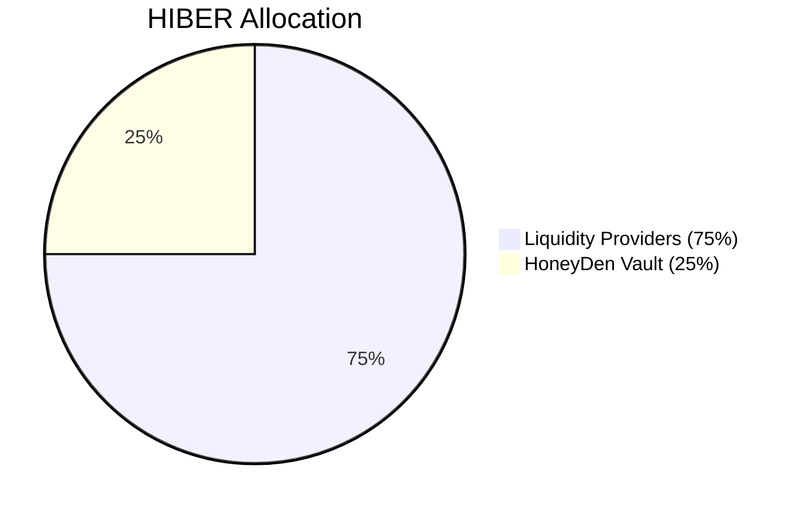
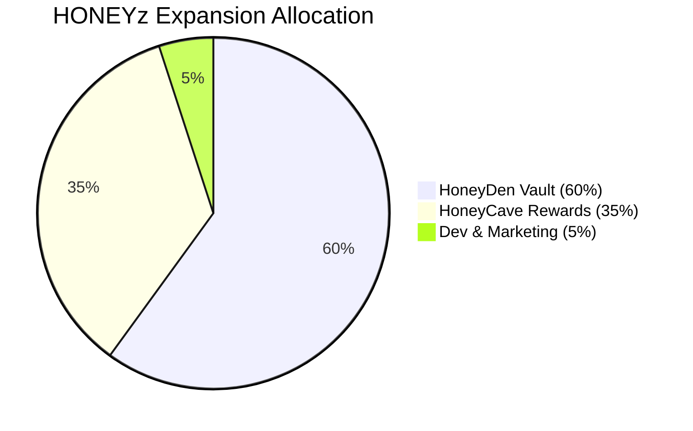

# 🐻❄️ HiberFi: Your Verifiably Stable Resting Place on Berachain

Welcome to **HiberFi**, a next-generation stable DeFi ecosystem built for resilience and sustainable growth on **Berachain**. We combine innovative elastic tokenomics, a robust **HONEY-backed** central vault (**HoneyDen**), transparent governance assisted by AI insights, and rewarding opportunities for long-term participants. HiberFi is designed to be the reliable foundation for your crypto assets.

## 🍯 HONEYzzz (HONEYz): Stability Anchored to Real Value

**HONEYzzz** (symbol: `HONEYz`) is our flagship elastic-supply token, meticulously designed to maintain a stable peg to Berachain's native **HONEY** stablecoin.

- **Stable Peg Target:** Algorithmically guided towards a tight $0.99–$1.01 HONEY range.
- **Elastic Supply Adjustments:** Daily supply rebases (max ±2%, adjustable by governance) occur *only* if the Time-Weighted Average Price (TWAP) over the preceding epoch drifts outside the target range, gently guiding the price back towards peg.
- **Verifiable Backing:** Every HONEYz aims for **direct 1:1 backing** by real HONEY held securely within the **HoneyDen Vault**. This is *not* just an algorithmic promise; it’s backed by tangible assets.
- **Peg Resilience:** In extreme market conditions, additional stability mechanisms (e.g., vault buybacks or redemption limits) ensure peg resilience.

---

## 🏦 The HoneyDen Vault: The Heart of HiberFi's Stability

The HoneyDen Vault is the cornerstone of HONEYz’s stability and distinguishes HiberFi from purely algorithmic models.

- **Funding Sources:** Initially seeded by withdrawal fees during the Genesis Launch and sustained through:
  - **HoneyDen Stability Reserve (HSR)** fees.
  - Fees from HONEYz redemptions or Vault buyback/sell operations.
  - Strategic allocation of vested HIBER tokens (as decided by governance).
  - Yield generated by low-risk Berachain ecosystem strategies.
- **Target Collateralization Ratio (CR):** Strives for 100% CR. Transparent CR displayed on HiberFi dApp.
- **HoneyDen Growth Engine:** Vault reserves strategically deployed into low-risk, yield-bearing Berachain strategies, strengthening HONEYz backing.
- **Transparent Operations:** All activities publicly verifiable on-chain.

---

## 🎖️ HIBER: Governance, Rewards, and Long-Term Alignment

**HIBER** (symbol: `HIBER`) is the governance and reward token, empowering community-driven protocol decisions.

- **Max Supply:** 888 HIBER (extreme scarcity).
- **Distribution:** Linear distribution over 888 days:
  - **75% Liquidity Providers (666 HIBER):** Distributed through liquidity mining and staking rewards, guided by AI and governance.
  - **25% HoneyDen Vault (222 HIBER):** Linear vesting supporting long-term protocol health.

**HIBER** is the core governance and staking token of the **HiberFi Protocol**. Unlike many DeFi projects, HiberFi had **no pre-mine, no team allocations, and no VC funding**. Every token is community-distributed, aligning with the **BITCOIN SPIRIT**—true decentralization.

### 🚩 Fair Launch Commitment:

HiberFi commits to a **100% fair launch**:

- No governance tokens (HIBER) allocated to devs.
- Initial liquidity provided by devs won't farm HIBER; liquidity gradually withdrawn once community liquidity deepens.
- Only **5% of newly minted HONEYz** allocated to dev team during expansions for infrastructure and marketing, maintaining fairness.

---

## 🐝 Genesis Launch: Seeding the Ecosystem

- **Launch Date:** April 10, 2025 (12-day event)
- **HONEYz Distribution:**
  - Days 1–4: 12,000 HONEYz daily, 3% withdrawal fee.
  - Days 5–8: 8,000 HONEYz daily, 2% withdrawal fee.
  - Days 9–12: 4,000 HONEYz daily, 1% withdrawal fee.
  - Post Day 12: No emissions, 0% withdrawal fee.
- **Fee Allocation:** 100% withdrawal fees fund the HoneyDen Vault.

---

## 🚀 HIBER Farming & HoneyCave Boardroom

### 🐝 HIBER Farming

**Launch:** April 14, 2025

**🔁 Deposit & Harvest Fees:**
- ✅ **No fees** on deposits or harvests.

**📤 Withdrawal Fees:**
- **HIBER/HONEY Pool:** No withdrawal fee.
- **HONEYz/HONEY Pool:**
  - ⚠️ **25% withdrawal burned - 25% withdrawal locked:**
    - 50% of the withdrawal amount is split into:
      - **HONEYz** (fully burned).
      - **HONEY** (locked until **31/12/2026**).
    - Withdrawals made after the unlocking date will receive **100% of the locked HONEY**.

**🗓️ Weekly Vesting Schedule:**
- Weekly linear vesting every **Sunday at 12:00 PM UTC**.
- Vested HONEY is claimable for one week (until the next Sunday).
- **Unclaimed HONEY** is automatically donated to the **HoneyDen Vault**.

**🎯 Purpose of Fees:**
- Strengthen the **HONEYz peg** stability and long-term value.
- Foster **sustainable liquidity** and encourage user **loyalty**.

### 🐝 HoneyCave Boardroom

**HoneyCave Boardroom Launch:** April 17, 2025
- **Epoch Duration:** 4 hours.
- **Staking:** Earn HONEYz when TWAP > $1.01.
- **Withdrawal Lock:** 12 epochs (48 hours).
- **Reward Claim Lock:** 3 epochs (12 hours). Rewards expire after 18 epochs.
- **Claim Options:** Instant (50% burn), or Instant with HSR Fee.

**Loyalty Discounts on HSR Fees:**
- ≥ 15 days: 15% discount
- ≥ 45 days: 25% discount
- ≥ 90 days: 35% discount

---

## 📌 HONEYz Expansion Allocation

| Allocation            | %   |
|-----------------------|-----|
| **HoneyDen Vault**    | 60% |
| **HoneyCave Rewards** | 35% |
| **Dev & Marketing**   | 5%  |

---

## 🧠 AI Co-Pilot Governance

- AI-driven recommendations for key decisions.
- Transparent and verifiable methods for all major protocol changes, driven by community votes.

---

## 🚧 Robust Stability Mechanisms

- **Expansion Mechanisms:** Minting, partial sales.
- **Contraction Mechanisms:** Rebases, redemption, buybacks.

---

## 🌟 Why HiberFi?

- Asset-backed stability.
- Community-first ethos.
- Transparent governance.
- Security-focused with on-chain auditability.

---

## 🗺️ Roadmap

- **Phase 1:** Stability, farming, governance integration.
- **Phase 2:** Introduction of new pegged assets and diversified strategies.
- **Phase 3:** Partnerships, cross-chain implementations, and ecosystem growth.

---

## 📝 Final Words

HiberFi is more than just another DeFi protocol. It’s a carefully crafted system designed to provide stability, security, and fairness in an ever-changing and often volatile crypto landscape. By combining transparent governance, AI-driven insights, and tangible backing, we are creating an ecosystem that prioritizes long-term sustainability over short-term rewards. Our commitment to a fair launch and community empowerment ensures that every participant has an equal opportunity to thrive as we build this resilient platform together.

We invite you to join us in this exciting journey. Whether you're looking to farm, stake, or simply be a part of a new era of decentralized finance, HiberFi offers a safe, transparent, and rewarding environment to grow your assets.

**Let’s hibernate together in a safe and rewarding DeFi ecosystem.**

---

## 🌐 Join the Hibernation!

- [Website](https://www.hiber.fi) | [Twitter](https://x.com/hiberfi) | [Telegram](https://t.co/hiberfi) | [Discord](https://discord.gg/hiberfi)

**Relax, stake securely, and let your assets grow steadily with HiberFi. Experience DeFi stability as peaceful as a long winter’s nap.**

*Welcome to restful DeFi.* 🐻❄️🍯
