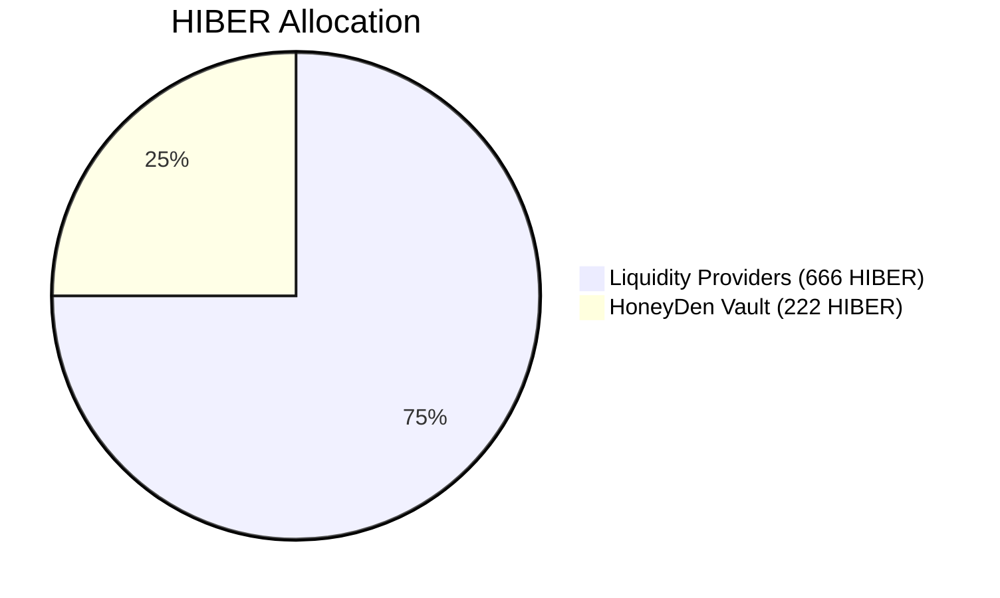
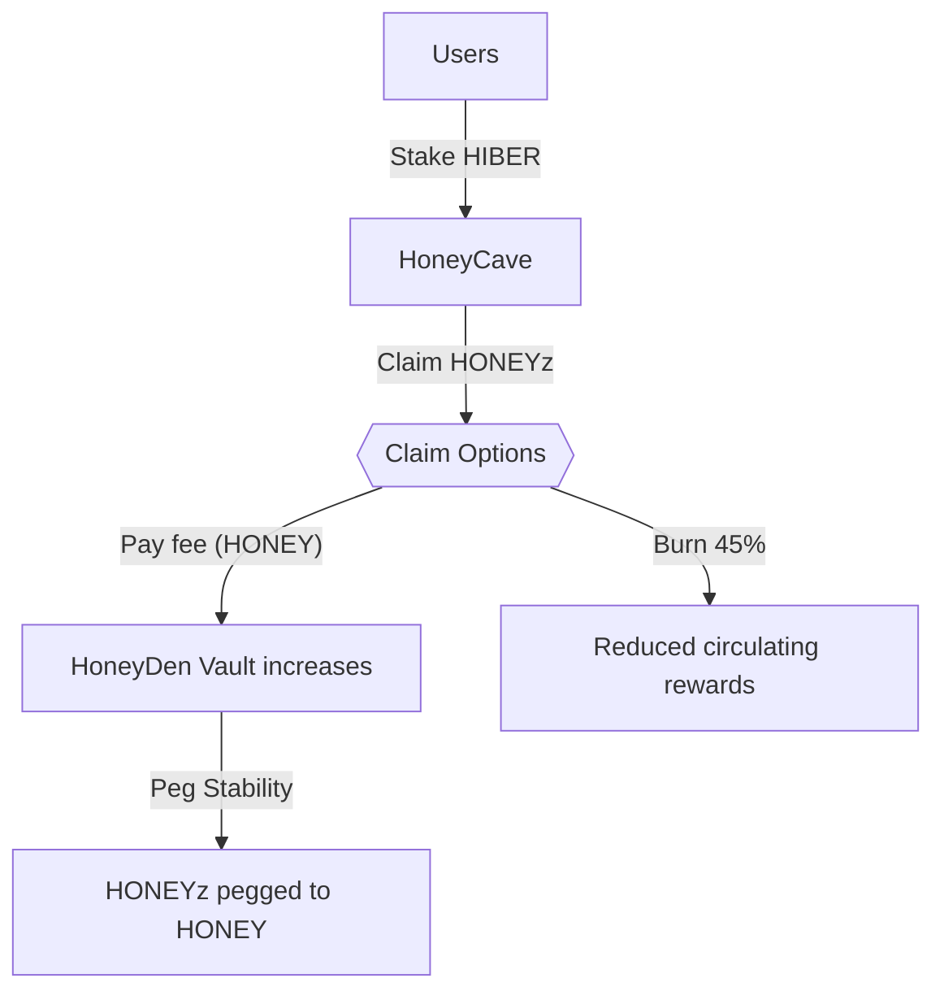
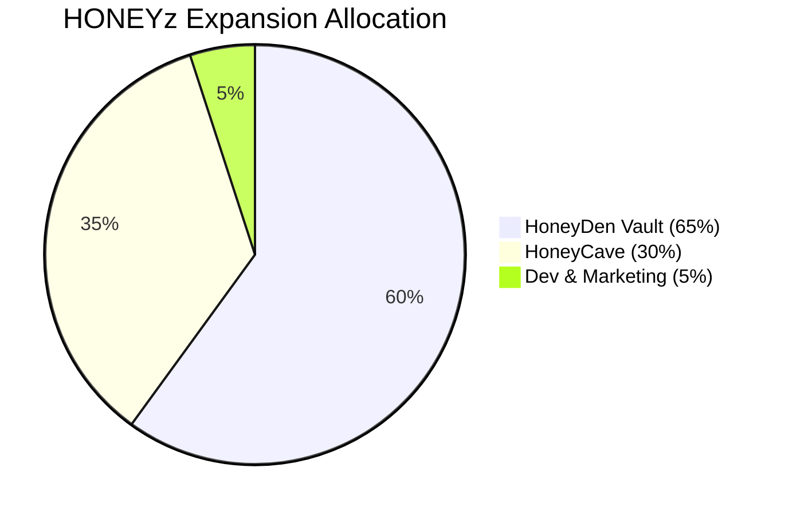

# 🐻❄️ HiberFi: Your Verifiably Stable Resting Place on Berachain

Welcome to **HiberFi**, a next-generation stable DeFi ecosystem built for resilience and sustainable growth on **Berachain**. We combine innovative elastic tokenomics, a robust **HONEY-backed** central vault (**HoneyDen**), transparent governance assisted by AI insights, and rewarding opportunities for long-term participants. HiberFi is designed to be the reliable foundation for your crypto assets.

## 🍯 HONEYzzz (HONEYz): Stability Anchored to Real Value

**HONEYzzz** (symbol: `HONEYz`) is our flagship elastic-supply token, meticulously designed to maintain a stable peg to Berachain's native **HONEY** stablecoin.

- **Stable Peg Target:** Algorithmically guided towards a tight $0.99–$1.01 HONEY range.
- **Elastic Supply Adjustments:** Daily supply rebases (max ±2%, adjustable by governance) occur *only* if the Time-Weighted Average Price (TWAP) over the preceding epoch drifts outside the target range, gently guiding the price back towards peg.
- **Verifiable Backing:** Every HONEYz aims for **direct 1:1 backing** by real HONEY held securely within the **HoneyDen Vault**. This is *not* just an algorithmic promise; it’s backed by tangible assets.
- **Peg Resilience:** In extreme market conditions, additional stability mechanisms (e.g., vault buybacks or redemption limits) ensure peg resilience, detailed under Stability Mechanisms.

## 🏦 The HoneyDen Vault: The Heart of HiberFi's Stability

The HoneyDen Vault is the cornerstone of HONEYz’s stability and distinguishes HiberFi from purely algorithmic models.

- **Funding Sources:** Initially seeded by withdrawal fees during the Genesis Launch and sustained through:
  - A portion of **HoneyDen Stability Reserve (HSR)** fees.
  - Fees from HONEYz redemptions or Vault buyback/sell operations.
  - Strategic allocation of vested HIBER tokens (as decided by governance).
  - Potential yield generated by the vault itself.
- **Target Collateralization Ratio (CR):** Strives to maintain 100% CR. Transparent CR displayed on the HiberFi dApp.
- **HoneyDen Growth Engine:** Vault HONEY reserves may be deployed into low-risk, yield-bearing strategies within the Berachain ecosystem. Generated yield flows back to strengthen HONEYz backing over time.
- **Transparent Operations:** All vault activities publicly verifiable on-chain.

## 🎖️ HIBER: Governance, Rewards, and Long-Term Alignment

**HIBER** (symbol: `HIBER`) is the governance and reward token, empowering community-driven protocol decisions.

- **Max Supply:** 888 HIBER (extreme scarcity).
- **Distribution:** Total supply over 888 days:
  - **75% Liquidity Providers (666 HIBER):** Distributed through liquidity mining and staking rewards, governed by both AI-driven emissions and community governance decisions.
  - **25% HoneyDen Vault (222 HIBER):** Vesting linearly over time, ensuring the Vault remains a long-term pillar of protocol health and growth.
**HIBER** is the core governance and staking token of the **HIBERNATION Protocol**. In contrast to many DeFi projects, HiberFi had no pre-mine, no team allocations, and no venture capital funding. Every single token is distributed to the community through liquidity mining and staking rewards, with a quarter reserved for the HoneyDen Vault, which also benefits users directly. This follows the **BITCOIN SPIRIT** — a truly decentralized, community-driven crypto project.

**Fair Launch Commitment:**

HiberFi is proud to announce that this project is **100% fairly launched**. No governance tokens (HIBER) have been allocated to the development team, and the initial liquidity provision by the team will **not** be used to farm HIBER. These liquidity tokens will be gradually removed once sufficient liquidity depth has been achieved, ensuring that early contributors do not have an unfair advantage.

In addition, only **5% of minted HONEYz** will be assigned to the development team **during expansion** phases, when the protocol grows and needs to support infrastructure expenses and marketing efforts. This small portion is designed to cover the costs of furthering the project's long-term vision, ensuring its sustainability while maintaining the decentralization and fairness of the protocol.

## 🐝 Genesis Launch: Seeding the Ecosystem

- **Launch Date:** April 10, 2025 (12-day event)
- **HONEYz Distribution:**
  - Days 1–4: 12,000 HONEYz daily, 3% withdrawal fee.
  - Days 5–8: 8,000 HONEYz daily, 2% withdrawal fee.
  - Days 9–12: 4,000 HONEYz daily, 1% withdrawal fee.
  - Post Day 12: No bonus emissions, 0% withdrawal fee.
- **Fee Allocation:** 100% withdrawal fees fund the HoneyDen Vault.

## 🚀 HIBER Farming & HoneyCave Boardroom

- **HIBER Farming Launch:** April 14, 2025
  - **No HSR fee** will be charged for farming.
  - **Withdrawal Fees:**
    - **No fee for HIBER/HONEY pool withdrawals**.
    - **50% withdrawal fee for HONEYz/HONEY pool**. The entire fee will be burned immediately, and liquidity will be locked forever.

  The goal of these changes is to maintain the peg and avoid charging fees from liquidity providers, encouraging long-term sustainability and stability.

- **HoneyCave Boardroom Launch:** April 17, 2025
  - **Epoch Duration:** 4 hours.
  - **Staking:** Earn HONEYz when TWAP > $1.01.
  - **Withdrawal Lock:** 12 epochs (48 hours).
  - **Reward Claim Lock:** 3 epochs (12 hours). Rewards expire after 18 epochs.
  - **Claim Options:** Instant (50% burn), or Instant with HSR Fee.
- **Loyalty Discounts on HSR Fees:**
  - ≥ 15 days: 15% discount
  - ≥ 45 days: 25% discount
  - ≥ 90 days: 35% discount

### 📌 HONEYz Expansion Allocation (When Above Peg)
| Allocation            | Percentage |
|-----------------------|------------|
| **HoneyDen Vault**    | 60%        |
| **HoneyCave Rewards** | 35%        |
| **Dev & Marketing**   | 5%         |

## 🚧 Robust Stability Mechanisms (Powered by HoneyDen)

- **Expansion:** Minting new HONEYz; partial sale to boost reserves.
- **Contraction:** Negative rebases, direct collateral redemption, vault buybacks.

## 🧠 AI Co-Pilot for Transparent Governance

- **AI Role:** Provides data-driven recommendations to governance.
- **Community Control:** All significant changes require community votes.
- **Transparency:** AI training data and methodology publicly documented.

## 🛡️ Dedicated Insurance Fund

- 1–2% of protocol fees fund the Insurance Fund, providing extra security against exploits.

## 🌟 Why Choose HiberFi?

- Verifiable HONEY backing
- Multi-layered peg stability
- Sustainable yield
- Loyalty-driven rewards
- Transparent AI-assisted governance
- Security-focused (insurance fund, rigorous audits)

## 🗺️ Roadmap & Vision

- **Phase 1:** HONEYz stability, HIBER farming, HoneyCave governance.
- **Phase 2:** New pegged assets, multi-asset collateral.
- **Phase 3:** Partnerships, cross-chain opportunities, expanded HONEYz utility.
- **Ongoing:** Governance tools, security enhancements, education resources.

## 🌐 Join the Hibernation!

- **Website:** [www.Hiber.Fi](https://www.hiber.fi)
- **Twitter:** [@hiberfi](https://x.com/hiberfi)
- **Telegram:** [HiberFi Telegram](https://t.co/hiberfi)
- **Discord:** [Join Here](https://discord.gg/hiberfi) (Launching Soon!)
- **Detailed Docs:** Coming Soon!

**Relax, stake securely, and let your assets grow steadily with HiberFi. Experience DeFi stability that feels as peaceful as a long winter’s nap.**

*Welcome to the future of restful DeFi.*
